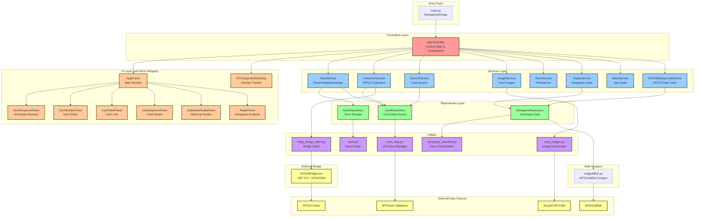

# Architecture

MTGO Metagame Deck Builder is a wxPython desktop application for Windows that provides metagame research, deck building, opponent tracking, and collection management for Magic: The Gathering Online players.

## Generating Diagrams

Update architecture diagrams automatically:

```bash
python scripts/generate_architecture_diagram.py
python scripts/generate_dependency_diagram.py
```

The architecture diagram is generated by analyzing the codebase structure via AST parsing. The dependency diagrams use pydeps to visualize module imports.

## Architecture Overview



## Layer Responsibilities

**Controllers**: Central coordination, state management, and business logic orchestration via AppController

**Services**: Business logic for decks, collections, search, images, metagame analysis, and background tasks

**Repositories**: Data access layer for cards, decks, and metagame information with caching

**UI/Widgets**: wxPython GUI components for research, building, tracking, and analysis

**Utils**: Card data management, image downloading, archetype classification, deck parsing, and MTGO bridge

**Navigators**: Web scrapers for MTGGoldfish metagame and tournament data

**External Bridge**: .NET application using MTGOSDK to communicate with MTGO client

## Data Flow

Metagame research: MTGGoldfish scraping → MetagameRepository caching → UI display
Deck building: Card search → DeckService parsing → CardTablePanel rendering
Collection sync: MTGO bridge → CollectionService → Ownership marking in UI
Card images: Scryfall bulk data + CDN → ImageService caching → Display
